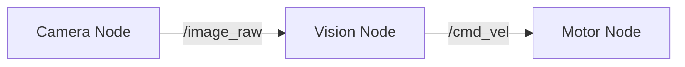

# ROS 2 Nodes, Topics, and Services

## The Computational Graph
A ROS 2 system is a graph of nodes processing data.

### Nodes
A **Node** is a single process that performs a specific task (e.g., reading a laser scanner, controlling a wheel motor). A robot is made of many nodes working in parallel.

### Topics (Pub/Sub)
Nodes communicate by streaming data over **Topics**.
- **Publisher**: Sends data (e.g., `sensor_node` sends `Temperature`).
- **Subscriber**: Listens for data (e.g., `control_node` listens to `Temperature`).
- *One-to-Many*: One publisher can talk to many subscribers.

### Services (Req/Res)
For synchronous tasks, we use **Services**.
- **Client**: Sends a request (e.g., "Take a photo").
- **Server**: Performs the action and sends a response (e.g., "Photo taken").

## Diagram

